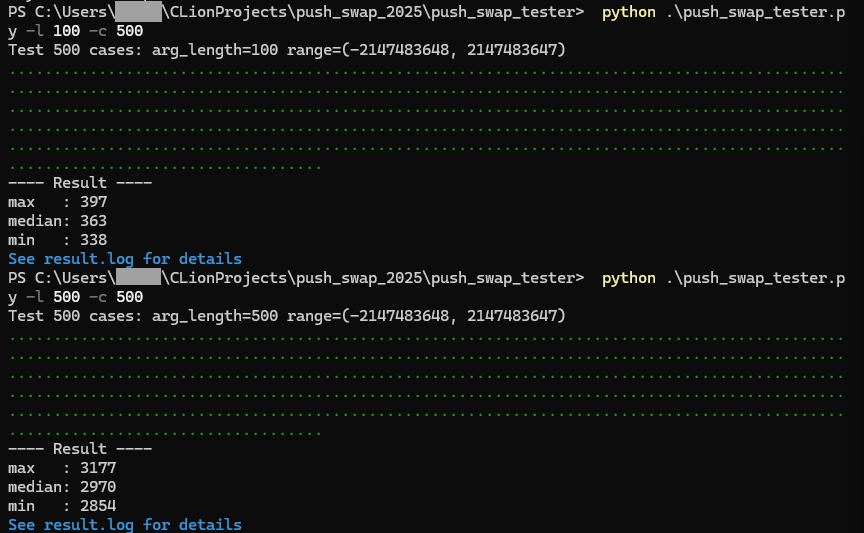

# push_swap

`push_swap` is a C++20 implementation for the 42 push_swap project.

Note: This repository has not been fully cleaned up. Many files are remnants of earlier experiments and are no longer used by the current solver. They are kept for now because safely identifying and removing all inactive code would require more cleanup work than was practical for this release.

## Requirements

- CMake 3.25 or newer
- A C++20 compiler

Confirmed environments:

- Windows with MinGW-w64 / GNU g++ 12.2.0
- macOS 13 with Homebrew CMake and Homebrew LLVM clang++ 22.1.8

## Benchmark Results

The following benchmark was measured on 500 random cases for each input size. The measurements were collected with `push_swap_tester`.

Environment:

- CPU: Intel Core i7-13700F
- GPU: NVIDIA GeForce RTX 3070



For 100 elements, the median operation count was 363, and each case took about 1 minute 30 seconds.

For 500 elements, the median operation count was 2970, and each case took about 2 minutes 20 seconds.

Runtime depends on the machine and build environment.

## Build on Windows

Use MinGW Makefiles. Make sure `g++` and `cmake` are available in `PATH`.

You can check them with:

```cmd
g++ --version
cmake --version
```

Then build:

```cmd
cmake -S . -B build-make -G "MinGW Makefiles"
cmake --build build-make --target push_swap
```

To build the checker:

```cmd
cmake --build build-make --target checker
```

## Build on macOS

The default AppleClang on older macOS installations may fail to build C++20 code using `<source_location>`.
If that happens, install Homebrew LLVM and configure CMake with Homebrew clang++.

```bash
brew install cmake llvm
```

macOS builds may require an updated Command Line Tools installation.
If Homebrew reports outdated Command Line Tools, update them before installing or upgrading CMake/LLVM.

Note: On macOS, Clang may emit stricter compiler warnings during the build. In the confirmed macOS environment, the build completed successfully and the generated executable passed basic checks, so these warnings are currently accepted rather than fixed.

On Intel Mac, Homebrew is usually installed under `/usr/local`:

```bash
rm -rf build
cmake -S . -B build \
  -DCMAKE_C_COMPILER=/usr/local/opt/llvm/bin/clang \
  -DCMAKE_CXX_COMPILER=/usr/local/opt/llvm/bin/clang++
cmake --build build --target push_swap
```

On Apple Silicon, Homebrew is usually installed under `/opt/homebrew`:

```bash
rm -rf build
cmake -S . -B build \
  -DCMAKE_C_COMPILER=/opt/homebrew/opt/llvm/bin/clang \
  -DCMAKE_CXX_COMPILER=/opt/homebrew/opt/llvm/bin/clang++
cmake --build build --target push_swap
```

To build the checker:

```bash
cmake --build build --target checker
```

## Run

Windows:

```cmd
.\push_swap 3 2 1
```

macOS:

```bash
./push_swap 3 2 1
```

## Check Output

Windows:

```cmd
.\push_swap 3 2 1 | .\checker 3 2 1
```

macOS:

```bash
./push_swap 3 2 1 | ./checker 3 2 1
```

If the result is valid, checker prints:

```text
OK
```
